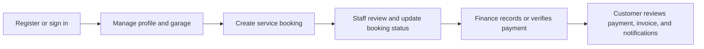
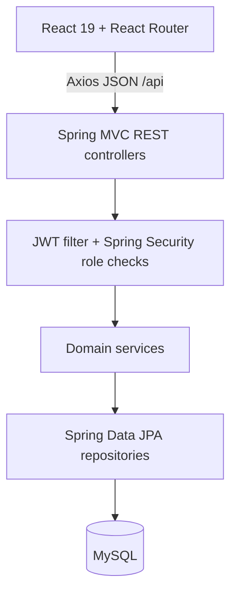
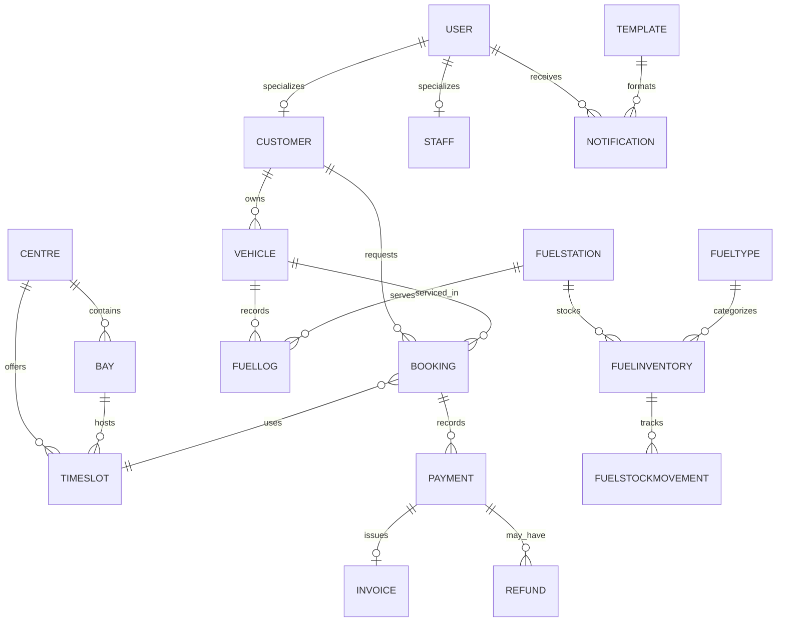

# AutoFlow Sri Lanka

> A full-stack operations portal for coordinating vehicle service bookings, workshop capacity, fuel station inventory, payments, and customer records.

AutoFlow Sri Lanka brings customer self-service and staff workflows into one web application. Customers can manage their garage, request service, review payment and fuel records, and receive system notifications. Authorized staff manage bookings, locations and slots, fuel operations, payments, and administrative reporting through a React interface backed by a Spring Boot REST API and MySQL.


## Contents

- [Overview](#overview)
- [Problem and solution](#problem-and-solution)
- [Features](#features)
- [Roles and access](#roles-and-access)
- [Workflows and architecture](#workflows-and-architecture)
- [Technology stack](#technology-stack)
- [Repository structure](#repository-structure)
- [Data model](#data-model)
- [API reference](#api-reference)
- [CRUD coverage](#crud-coverage)
- [Authentication and security](#authentication-and-security)
- [Frontend](#frontend)
- [Backend](#backend)
- [Validation and errors](#validation-and-errors)
- [Setup and configuration](#setup-and-configuration)
- [Testing](#testing)
- [Development status and limitations](#development-status-and-limitations)
- [Troubleshooting](#troubleshooting)
- [Deployment](#deployment)
- [Contributing](#contributing)
- [License and acknowledgements](#license-and-acknowledgements)
- [Project highlights](#project-highlights)

## Overview

AutoFlow is a web-based vehicle service and fuel station management system. It is intended for customers and operational staff who need a shared view of customer vehicles, service requests, capacity, fuel records, and financial activity. The codebase combines a customer-facing self-service experience with role-specific staff pages and API permissions.

At a high level, users authenticate, access the pages available to their role, and make requests to a stateless JSON API. The backend applies role and ownership checks, carries out business operations through services and Spring Data repositories, and persists application entities in MySQL.

### Problem and solution

| Operational need | Implemented capability | Benefit |
| --- | --- | --- |
| Keep customer and vehicle records together | User/customer and vehicle records with customer garage endpoints | Staff and customers can work with vehicle ownership data |
| Coordinate service requests | Booking records, centres, bays, and time slots | Service activity and available capacity have a shared representation |
| Track fuel station stock | Station, fuel type, inventory, movement, and summary APIs | Stock adjustments and operational summaries are recorded centrally |
| Review payments | Booking-linked payment records, verification, invoices, and refunds | Financial activity can be reviewed by authorized staff and customers |
| Share customer-facing updates | In-app notification records, read state, and templates | Users can review notifications in the application |

This describes the current code, not a claim that every workflow is fully automated. Slot assignment/rescheduling and dedicated workshop work orders are not implemented as complete workflows.

## Features

### Accounts and access

- Customer registration and login; staff accounts are created pending activation.
- Administrator registration requires a configured access code.
- BCrypt password hashing and signed JWT authentication.
- Roles include `ADMIN`, `CUSTOMER`, `CUSTOMER_SERVICE_OFFICER`, `SCHEDULING_OFFICER`, `WORKSHOP_OPERATIONS_MANAGER`, `FINANCE_OFFICER`, and `FUEL_STATION_MANAGER`.
- Self-service profile updates, with a system notification when profile details change.

### Vehicles and service bookings

- Customer garage and vehicle creation, including server-side ownership assignment for customer-created vehicles.
- Staff vehicle lookups, and administrator vehicle editing/deletion.
- Booking creation, customer booking history, staff booking lookup, status updates, and administrator deletion.
- Centre, bay, and time-slot management with role-limited write operations.
- Service history and waiting-list entities exist in the domain model; a complete waiting-list promotion/rescheduling UI is not present.

### Fuel operations

- Fuel stations, fuel types, station inventory, stock updates, and stock movement history.
- Low-stock and period-based operational summary data through the fuel service.
- Fuel logs associated with vehicles and stations, with staff status updates and deletion.
- Customer access to fuel logs is scoped through vehicle ownership policies.

### Payments and reporting

- Booking-linked payments, finance verification, customer payment history, invoices, refundable-balance lookup, and finance refund requests.
- An administrator-only system report summary endpoint.
- These records do not represent a payment gateway integration; payment processing is application-side record management.

### Notifications and audit records

- In-app notifications, read/unread status, unread counts, bulk notification operations, and notification templates.
- Administrator audit-log read/create/delete endpoints.
- The code models notification channels, but no external email or SMS provider integration is configured in the repository.

## Roles and access

Backend method-level security is the source of authorization. Frontend role routes provide navigation/page gating as well, but are not a replacement for the API checks.

| Area | Customer | Admin | Customer service | Scheduling | Workshop ops | Finance | Fuel manager |
| --- | --- | --- | --- | --- | --- | --- | --- |
| Own profile, garage, and history | ✅ | ✅ | 🔒 | 🔒 | 🔒 | 🔒 | 🔒 |
| Customer/user administration | — | ✅ | Customer read access | — | — | — | — |
| Booking access and creation | Own records | ✅ | ✅ | Read/status scope | Read/status scope | Read-only booking view | — |
| Centres and capacity | Read | Manage | Read | Manage bays/slots | — | — | — |
| Vehicle access | Own garage | ✅ | Staff lookup | Staff lookup | Staff lookup | — | Read/list and scoped fuel operations |
| Payment and refund operations | Own payments | ✅ | — | — | — | ✅ | — |
| Fuel stations, inventory, and logs | Own vehicle logs | ✅ | — | — | — | — | ✅ |
| Notifications | Own | ✅ | Send/manage templates | — | — | — | Role-limited page access |
| Reports and audit | — | ✅ | — | — | — | — | Fuel summaries only |

`✅` indicates implemented access for the area; `🔒` indicates that the role does not receive general access. Exact endpoint annotations can be narrower than a broad module description above. For the detailed policy notes, see [`docs/role-access.md`](docs/role-access.md).

## Workflows and architecture

### Customer service flow



The diagram shows available application capabilities, not an enforced end-to-end state machine. The repository does not implement a complete slot assignment/rescheduling workflow or an external payment provider flow.

### Application architecture



The frontend uses route/page components and small API service modules. The backend groups code by domain (booking, fuel, payment, user, vehicle, notification, reporting), with controllers, services, repositories, and JPA entities where applicable. Hibernate `ddl-auto=update` currently updates the schema at application startup. The SQL file in `database/` is a historic SQL Server DDL/sample script and should not be treated as the live MySQL schema or a current migration.

## Technology stack

| Area | Technologies detected |
| --- | --- |
| Frontend | React 19, React Router 7, Vite 8, Axios |
| UI | Ant Design 6, Ant Design Icons, Framer Motion, project CSS |
| Backend | Java 21, Spring Boot 3.4.1, Spring MVC, Spring Security, Spring Data JPA, Bean Validation |
| Database | MySQL Connector/J; Hibernate ORM |
| Authentication | JWT via JJWT 0.11.5; BCrypt password encoder |
| API docs | Springdoc OpenAPI / Swagger UI |
| Build and lint | Maven; npm; Vite; Oxlint |
| Tests | Spring Boot test starter, JUnit-based JWT service test |
| Deployment | No deployment or container configuration detected |
| Version control | Git; remote configured as `lojanasarma/AutoFlowSriLanka` |

## Repository structure

```text
AutoFlowSriLanka/
├── assets/
│   ├── README.md
│   └── tools/
├── backend/
│   ├── pom.xml
│   └── src/
│       ├── main/java/lk/autoflow/backend/
│       │   ├── auth/ config/ dto/ security/
│       │   ├── booking/ fuel/ notification/ payment/
│       │   ├── report/ user/ vehicle/
│       │   └── GlobalExceptionHandler.java
│       ├── main/resources/
│       └── test/java/
├── database/
│   ├── autoflow_schema.sql
│   └── legacy/
├── docs/
│   ├── role-access.md
│   └── supporting-documents/
├── frontend/
│   ├── public/
│   └── src/
│       ├── api/ components/ layouts/ pages/ services/
│       ├── App.jsx
│       └── main.jsx
├── LICENSE
└── README.md
```

The `backend` package folders group domain code; most include a controller, service, repository, and entity classes, although the exact set varies by module. Frontend `pages/` holds route-level screens, `services/` wraps backend API calls, `api/` configures Axios, and `layouts/` contains the authenticated application shell. `database/legacy/` contains historical SQL Server support material.

## Data model

The live persistence model is defined by JPA entities and the MySQL connection configured in Spring Boot. Notable entities include:

| Domain | Entities and key relationships |
| --- | --- |
| Identity | `User`, with `Customer` and `Staff` specializations; staff stores a department and account status |
| Vehicles | `Vehicle` belongs to an owner; `VehicleDocument` is associated with a vehicle |
| Service | `Booking` references a customer, vehicle, centre, and time slot; `Bay` belongs to a centre; `TimeSlot` references a centre and bay; `ServiceHistory` and `WaitingList` reference bookings/vehicles |
| Fuel | `FuelInventory` references a station and fuel type; `FuelStockMovement` references inventory and an actor; `FuelLog` references vehicle and station |
| Finance | `Payment` references a booking; `Invoice` references a payment; `Refund` references a payment and deciding staff member |
| Communications | `Notification` references a user and template; `AuditLog` records actor and entity/action details |



This is a conceptual view of associations in the current entity mappings, not a replacement schema. The checked-in SQL Server script has a different historical design and engine-specific syntax. For accurate local database setup, allow the JPA mappings to create/update tables in a MySQL database.

## API reference

All routes are prefixed with `/api`. Except for authentication and API documentation routes, requests require a valid bearer JWT. The list below summarizes controller mappings; the source annotations define the exact role and ownership policies. JSON payload fields follow the corresponding request/entity classes.

| Module | Method and endpoint | Purpose / access |
| --- | --- | --- |
| Auth | `POST /auth/register`, `POST /auth/login` | Public registration and login; registration response may include a token for active users |
| Users | `GET /users`, `GET /users/customers`, `POST /users`, `PUT /users/{id}`, `PATCH /users/{id}/status`, `PATCH /users/me`, `DELETE /users/{id}` | Admin user maintenance; customer list for admin/customer service; authenticated self-profile update |
| Vehicles | `GET /vehicles`, `GET /vehicles/reg/{regNo}`, `GET /vehicles/owner/{ownerId}`, `GET /vehicles/my-garage`, `POST /vehicles`, `PUT /vehicles/{id}`, `DELETE /vehicles/{id}` | Staff lookups, customer own-garage access, vehicle creation, admin maintenance |
| Bookings | `GET /bookings`, `GET /bookings/ref/{ref}`, `GET /bookings/my-bookings`, `POST /bookings`, `PATCH /bookings/{bookingId}/status?status=...`, `DELETE /bookings/{id}` | Staff views, customer own history, create/status management, admin delete |
| Scheduling | `GET/POST /scheduling/centres`, `PUT/DELETE /scheduling/centres/{centreId}`, `GET /scheduling/bays?centreId=...`, `POST /scheduling/bays`, `PUT/DELETE /scheduling/bays/{bayId}`, `GET /scheduling/slots?centreId=...`, `POST /scheduling/slots` | Read centres/bays/slots; admin centre management; admin/scheduling officer capacity writes, with admin-only updates/deletes for bays/centres |
| Fuel | `GET/POST /fuel/stations`, `PUT/DELETE /fuel/stations/{stationId}`, `GET /fuel/types`, `POST /fuel/types`, `PATCH /fuel/types/{fuelTypeId}/status`, `GET/POST /fuel/inventory`, `PUT /fuel/inventory/{inventoryId}`, `POST /fuel/inventory/{inventoryId}/stock`, `GET /fuel/stock-movements`, `GET /fuel/reports/summary` | Station, type, inventory, stock movement, and summary operations; write access is role restricted |
| Fuel logs | `GET /fuel/logs/vehicle/{vehicleId}`, `GET /fuel/logs/station/{stationId}`, `POST /fuel/logs`, `PATCH /fuel/logs/{logId}/status`, `DELETE /fuel/logs/{logId}` | Vehicle-owner-scoped log access/creation and fuel-manager/admin station operations |
| Payments | `GET /payments`, `GET /payments/booking/{bookingId}`, `GET /payments/my-payments`, `GET /payments/{paymentId}/invoice`, `GET /payments/{paymentId}/refundable-balance`, `POST /payments`, `POST /payments/{paymentId}/verify`, `POST /payments/refund`, `DELETE /payments/{paymentId}` | Customer-owned history, finance/admin review and verification, finance refund requests, admin delete |
| Notifications | `GET /notifications/user/{userId}`, `POST /notifications/send`, `POST /notifications/send-bulk`, `PATCH /notifications/{id}/status`, `PATCH /notifications/user/{userId}/mark-all-read`, `GET /notifications/user/{userId}/unread-count`, `DELETE /notifications/{id}` | User-scoped notification operations and staff sending |
| Templates and audit | `GET/POST /notifications/templates`, `PUT/DELETE /notifications/templates/{id}`, `GET/POST /notifications/audit/{entity or empty}`, `DELETE /notifications/audit/{id}` | Admin template maintenance and audit operations; customer service can read templates |
| Reports | `GET /reports/summary` | Administrator report summary |

`GET/POST` shorthand denotes separate HTTP methods on the same path. `POST /notifications/audit` has no `{entity}` path segment; it records an audit entry. Swagger UI is exposed at `/swagger-ui/index.html`, with OpenAPI docs under `/v3/api-docs`.

### Example: authenticate

```http
POST /api/auth/login
Content-Type: application/json
```

```json
{
  "email": "customer@example.com",
  "password": "YOUR_ACCOUNT_PASSWORD"
}
```

An active account receives a response containing a JWT and user information. Send the token on protected requests:

```http
GET /api/vehicles/my-garage
Authorization: Bearer <token>
```

## CRUD coverage

| Module | Create | Read | Update | Delete | Notes |
| --- | --- | --- | --- | --- | --- |
| Users | ✅ | ✅ | ✅ | ✅ | Self profile and admin maintenance; status patch available |
| Vehicles | ✅ | ✅ | ✅ | ✅ | Admin update/delete; customer creates in own garage |
| Bookings | ✅ | ✅ | ✅ status | ✅ | Status patch; no general booking edit/reschedule endpoint |
| Centres | ✅ | ✅ | ✅ | ✅ | Admin writes |
| Bays | ✅ | ✅ | ✅ | ✅ | Scheduling/admin create; admin update/delete |
| Time slots | ✅ | ✅ | — | — | No update/delete controller mapping |
| Fuel stations | ✅ | ✅ | ✅ | ✅ | Fuel manager/admin |
| Fuel types | ✅ | ✅ | ✅ status | — | No general edit/delete mapping |
| Fuel inventory | ✅ | ✅ | ✅ | — | Stock adjustments tracked separately |
| Fuel logs | ✅ | ✅ | ✅ status | ✅ | Customer vehicle scoping and station staff operations |
| Payments | ✅ | ✅ | ✅ via verify | ✅ | Refund requests are separate records |
| Notifications | ✅ | ✅ | ✅ read state | ✅ | Read status and ownership-scoped delete |
| Templates | ✅ | ✅ | ✅ | ✅ | Admin maintenance |
| Audit logs | ✅ | ✅ | — | ✅ | Admin endpoints |

## Authentication and security

- Spring Security is stateless and uses a JWT authentication filter. Tokens are signed with HS256 and have a configurable expiration.
- Passwords are encoded with BCrypt. Registration checks duplicate email/mobile values; customers become active immediately, while staff registration creates a pending account.
- Administrator signup is gated by a configured administrator registration access code.
- Method-level `@PreAuthorize` checks constrain module operations by role. `AccessPolicy` adds ownership checks for user, booking, payment, notification, and fuel-vehicle resources.
- CORS allows configured origins and local loopback development origins. CSRF is disabled for the stateless API.
- Bean validation support and a global exception handler are configured. Some controllers also handle input and state errors directly.

### Security considerations

Sensitive defaults are present in the checked-in backend runtime configuration. They are deliberately not reproduced here. Treat any committed credentials or signing keys as compromised: replace/rotate them, remove them from the active configuration, and use environment-specific secret storage. The repository's example local properties file contains placeholders; however, the current `application.properties` also declares sensitive defaults and must be corrected before deployment.

Additional production hardening to consider:

- Move every credential and signing key to environment/secret configuration and fail startup when required secrets are missing.
- Disable SQL statement output and avoid returning raw exception messages to clients in production.
- Review frontend use of `localStorage` for bearer tokens against the deployment threat model, including XSS protections.
- Add rate limiting and abuse controls to public registration/login endpoints.
- Use managed schema migrations and production-grade database backup/least-privilege practices.

These are recommendations, not claims that those controls are currently present.

## Frontend

The React application uses React Router for `/login`, `/register`, and protected dashboard pages. The authenticated shell is in `layouts/MainLayout.jsx`; route-level pages include dashboard, users, reports, locations, vehicles, fuel, bookings, scheduling, payments, and notifications. API wrappers are grouped under `src/services/`, with a shared Axios client in `src/api/axios.js`.

Axios attaches the locally stored bearer token and maps common HTTP/network failures to Ant Design messages. The app configures a dark theme with amber accents, uses Ant Design components, and includes Framer Motion. Public visual assets are stored under `frontend/public/`. Responsive/accessibility behavior is implemented in page/layout styles, but no formal accessibility or responsive test suite was found.

## Backend

Controllers expose REST endpoints, services implement module operations, repositories use Spring Data JPA, and entity classes describe persistence. `GlobalExceptionHandler` maps validation, access-denied, response-status, and general exceptions into JSON responses.

```text
HTTP request
  → JWT filter / Spring Security
  → controller and method authorization
  → domain service
  → Spring Data repository
  → Hibernate / MySQL
  → JSON response
```

The project uses domain-oriented packages and service/repository layers. DTOs are used for select requests (for example vehicle creation); several other endpoints accept or return entity-shaped JSON directly.

## Validation and errors

Spring Boot validation is included, and request models/controllers perform some input and business-state checks. The API commonly returns `400` for invalid input, `401` for authentication failures, `403` for denied access, `404` for missing records, `409` for booking conflicts, and `500` for unhandled failures. Exact behavior varies by endpoint. Frontend API error handling displays messages for common status codes and network failures.

## Setup and configuration

### Prerequisites

- JDK 21
- Maven 3.9 or compatible
- Node.js/npm compatible with Vite 8
- MySQL server

### 1. Clone the repository

```bash
git clone https://github.com/lojanasarma/AutoFlowSriLanka.git
cd AutoFlowSriLanka
```

### 2. Configure MySQL and backend

Create a local MySQL database (the configured default database name is `autoflowsrilanka_db`). Before running, copy `backend/src/main/resources/application-local.properties.example` to `backend/src/main/resources/application-local.properties` and replace each placeholder with local values. That local file is ignored by Git.

Set a Base64-encoded random JWT signing key of at least 32 bytes and a long random administrator registration access code. Configure the datasource URL, username, password, and allowed browser origins in the local properties file. The checked-in runtime properties currently include unsafe literal defaults, so remove/override those values before using the application and do not deploy them. Environment variable support exists for selected settings (`DB_URL`, `JWT_EXPIRATION`, and `CORS_ALLOWED_ORIGINS`); the local properties file is the documented way to supply datasource credentials, JWT key, and administrator access code in development.

Start the API:

```bash
cd backend
mvn spring-boot:run
```

The backend listens on `http://localhost:8080`. Hibernate is configured with `ddl-auto=update` and creates/updates mapped tables. `database/autoflow_schema.sql` is a legacy SQL Server script; do not run it against MySQL.

### 3. Configure and start the frontend

In another terminal:

```bash
cd frontend
npm install
npm run dev
```

The Vite development server uses `http://localhost:3000` and proxies `/api` requests to `http://localhost:8080`. For a non-development API origin, copy `frontend/.env.example` to `.env` and set `VITE_API_URL` to the API base URL (for example `https://api.example.com/api`). Do not put secrets in frontend environment variables; Vite values are client-visible.

### Configuration reference

| Setting | Where it is read | Purpose |
| --- | --- | --- |
| `DB_URL` | Backend environment | JDBC URL override |
| Datasource username/password | Backend local properties | MySQL login |
| `jwt.secret` | Backend local properties | Base64 JWT signing key, minimum 32 decoded bytes |
| `JWT_EXPIRATION` | Backend environment | Token lifetime in milliseconds |
| `app.registration.admin-secret` | Backend local properties | Gate for administrator registration |
| `CORS_ALLOWED_ORIGINS` | Backend environment | Comma-separated allowed origins |
| `VITE_API_URL` | Frontend `.env` | Production/non-proxy API base URL |

The sample properties file is the authoritative development template. Never commit real values in `.env` or `application-local.properties`.

## Testing

The backend includes a JWT service unit test at `backend/src/test/java/lk/autoflow/backend/security/JwtServiceTest.java` and uses the Spring Boot test starter. Run backend tests with:

```bash
cd backend
mvn test
```

No frontend automated test framework or frontend test script is configured. The frontend provides `npm run lint` (Oxlint) and `npm run build`.

## Development status and limitations

| Area | Status | Current implementation |
| --- | --- | --- |
| Authentication and roles | ✅ Implemented | JWT, BCrypt, pending staff status, role/ownership checks |
| Customer and vehicle management | ✅ Implemented | Self-service garage plus staff/admin operations |
| Bookings | 🚧 Partial | Create, list, status, delete; no complete assignment/rescheduling workflow |
| Scheduling capacity | 🚧 Partial | Centres, bays, slots; no booking slot assignment flow exposed |
| Payments and refunds | 🚧 Partial | Records, verification, invoice lookup, refund requests; no external payment gateway |
| Fuel operations | ✅ Implemented | Inventory, stock movements, logs, and summaries |
| Notifications | 🚧 Partial | In-app records, templates, bulk operations; no configured email/SMS delivery provider |
| Workshop operations | 🚧 Partial | Booking status progression; no work order, technician assignment, or parts tracking |
| Admin reports | ✅ Implemented | Summary endpoint and dashboard page |
| Automated verification | 🚧 Partial | Backend unit-test foundation; no frontend tests or broad integration suite |
| Deployment automation | ❌ Not present | No Docker, CI workflow, or deployment manifest detected |

Known limitations include entity-shaped payloads on some APIs, no pagination contract evident in the controllers, JPA schema auto-update rather than versioned migrations, missing complete booking rescheduling/assignment, no external payment/email/SMS integrations, limited automated tests, and sensitive literal defaults in runtime configuration that must be replaced before use outside an isolated local environment.

### Future improvements

**Short term:** remove committed secret defaults, add validation and integration tests for critical authorization and booking/payment paths, and introduce versioned MySQL migrations.

**Medium term:** complete booking slot assignment/rescheduling and workshop work orders, add pagination and query filters where operational lists grow, and integrate a delivery provider for notifications if required.

**Long term:** add deployment automation, observability/health checks, and load/security testing for a production deployment.

## Troubleshooting

| Symptom | Checks |
| --- | --- |
| Backend cannot connect to MySQL | Confirm MySQL is running, database exists, JDBC URL is correct, and local datasource credentials are valid. |
| Tables or columns are missing | Confirm the application connected to the intended database; JPA updates the schema at startup. The SQL Server script is not the MySQL setup path. |
| JWT key startup/token error | Set a valid Base64 key that decodes to at least 32 bytes. |
| Browser reports CORS failure | Add the frontend origin to `CORS_ALLOWED_ORIGINS`; local loopback origins are allowed for development. |
| Frontend reports network/API errors | Start the backend on port 8080 or set the correct `VITE_API_URL`; verify the browser can reach it. |
| Port 3000 or 8080 is occupied | Stop the other process or configure the development server/backend port and matching CORS/API URL. |
| Staff user cannot log in | Staff accounts are pending until activated by an administrator. |

## Deployment

No Dockerfile, CI workflow, or deployment manifest was found. Deployment has not been established by the repository. For a deployment, build the frontend with `npm run build`, package/run the Spring Boot application with production configuration, serve the frontend over HTTPS, configure MySQL and CORS for the actual origin, replace all local secrets, turn off SQL logging, and use a managed migration and backup strategy. Treat this as a deployment outline, not an existing deployment recipe.

## Contributing

Contributions are welcome. Before opening a pull request:

1. Fork the repository and create a focused branch from the default branch.
2. Keep changes scoped and update relevant documentation.
3. Run the backend tests and frontend lint/build checks that apply to your change.
4. Commit with a clear description and push your branch.
5. Open a pull request describing the change, rationale, and verification performed.

Do not include credentials, local configuration, generated build output, or personal data in commits.

## License and acknowledgements

This repository includes an MIT License in [`LICENSE`](LICENSE). The project is built with Java, Spring Boot, Spring Security, Spring Data JPA, MySQL, React, Vite, Ant Design, Axios, and the other dependencies listed in the Maven and npm manifests.

## Project highlights

- Full-stack application with a React client and a Spring Boot REST API.
- Role-based access plus ownership-aware checks for customer resources.
- Domain coverage for vehicles, service bookings, capacity, fuel operations, payments, and notifications.
- Fuel stock movement records and administrative/reporting endpoints.
- Clear separation between current MySQL/JPA persistence and historical SQL Server design material.

AutoFlow Sri Lanka is a portfolio-stage management system with a broad set of connected operational modules. It has a layered Java backend, browser-based React frontend, and MySQL persistence; several core record-management flows are implemented, while scheduling orchestration, external integrations, test coverage, and production configuration still need further work.
